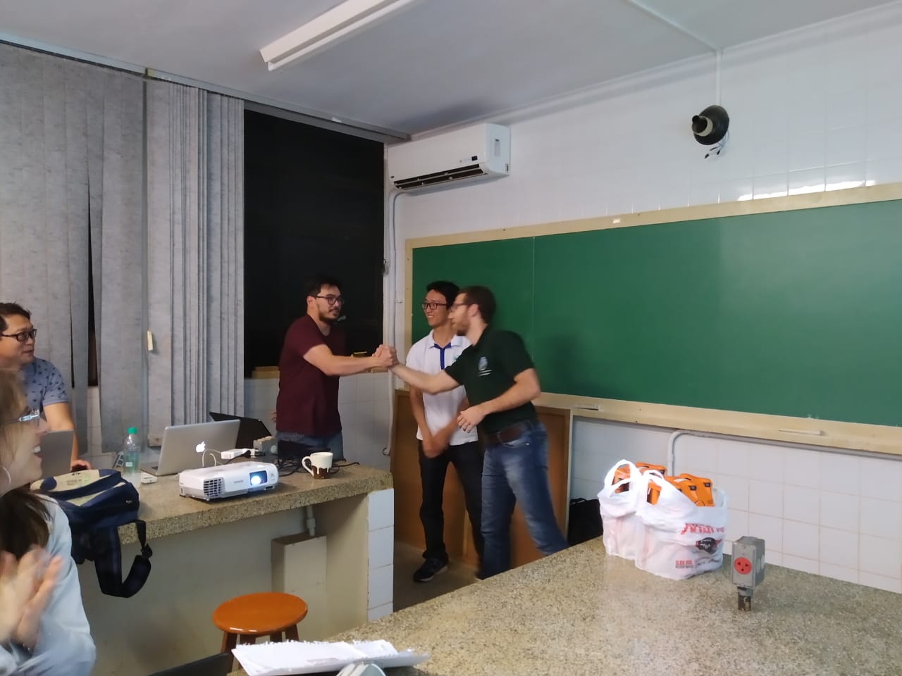

# Cursos

 - **Introdução ao software R nas ciências agrárias e biológicas** (Curso ministrado em Maio/Junho pelo google meet)
 
 
 
 - **Introdução ao software R com ênfase em ciência do solo** (Curso ministrado em Julho/2019 ao laboratório de solos da UEL)
 

{width=20%} {width=20%} {width=20%} {width=27%}

 

 - **Introdução ao software R aplicado à Agronomia** (Curso ministrado em Junho/2019 ao programa de pós-graduação em Agronomia da UEL) 
 

{width=24.8%} {width=18.85%} {width=24.9%} {width=18.85%} 

 

 - **II Curso básico do R aplicado à Agronomia** (Curso ministrado em Março/2019 no departamento de estatística da UEL)
 

 
{width=22%} {width=22%} {width=22%} {width=22%}

 

 - **Criação de documentos dinâmicos utilizando o Markdown do software R** (Curso ministrado em Setembro/2018 no departamento de estatística da UEL)

 
{width=20%} {width=32.2%} {width=36%}

 

 - **Introdução ao Rmarkdown** (Curso ministrado em Abril/2018 ao programa de pós-graduação em Agronomia da UEL)

  
